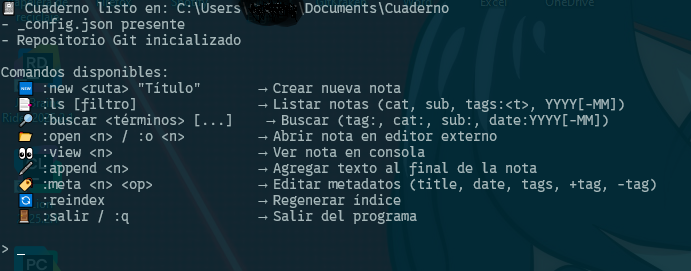
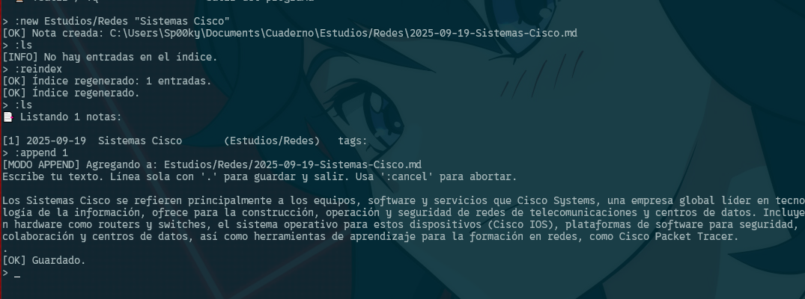
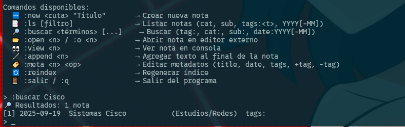
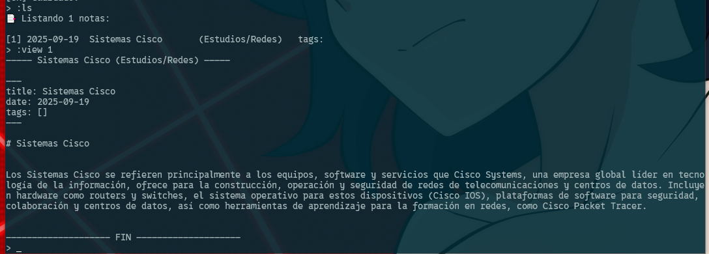

# Cuaderno — Bitácora de estudio (CLI/Terminal)

App minimalista para registrar apuntes rápidos de Instituto / laboratorio desde la terminal: crear nota, listar, buscar, etiquetas, exportar.

---

## 🖼️ Demo & Capturas


**Demo (GIF corto, 5–10 s):**

```

```

**Pantallas clave:**

| Inicio / Ayuda             | Nueva nota                      | Búsqueda                      | Lista / View            |
| -------------------------- | ------------------------------- | ----------------------------- | -------------------------- |
|  |  |  |  |


---

## 📚 Índice

- [Cuaderno — Bitácora de estudio (CLI/Terminal)](#cuaderno--bitácora-de-estudio-cliterminal)
  - [🖼️ Demo \& Capturas](#️-demo--capturas)
  - [📚 Índice](#-índice)
  - [✨ Características](#-características)
  - [🧱 Estructura del proyecto](#-estructura-del-proyecto)
  - [🛠️ Requisitos](#️-requisitos)
  - [📦 Instalación](#-instalación)
  - [⚡ Uso rápido](#-uso-rápido)
  - [⚙️ Configuración](#️-configuración)
  - [📤 Exportación / Respaldo](#-exportación--respaldo)
  - [🗺️ Roadmap](#️-roadmap)
  - [🤝 Contribuir](#-contribuir)
    - [Convención de commits](#convención-de-commits)
  - [❓ FAQ](#-faq)
  - [🧯 Problemas comunes](#-problemas-comunes)
  - [📄 Licencia](#-licencia)
  - [📌 Checklist antes de publicar](#-checklist-antes-de-publicar)
  - [🔗 Comandos Git rápidos](#-comandos-git-rápidos)

---

## ✨ Características

* **Notas instantáneas** desde terminal (`cuaderno add "mi nota" -t etiquetas`).
* **Etiquetas** (p. ej. `algoritmos`, `química`, `tareas`).
* **Búsqueda** por texto y/o etiqueta.
* **Listado** por fecha, etiqueta o texto.
* **Exportación** a Markdown/CSV.
* **Datos locales** simples (archivos `.md` o `.json/yaml`).
* **Diseño minimal**: una sola binary/app, sin dependencias raras.

---

## 🧱 Estructura del proyecto

```
cuaderno/
├─ src/                  # código fuente
├─ data/                 # notas (si se usa almacenamiento por archivos)
│  ├─ 2025/09/
│  │  └─ 2025-09-19_123456.md
├─ docs/
│  └─ images/            # capturas de pantalla y GIFs
├─ tests/                # pruebas (opcional)
├─ .gitignore
├─ README.md
└─ LICENSE
```

---

## 🛠️ Requisitos

* **Windows / Linux**.
* **.NET 8 / Python 3.11 / (tu runtime elegido)** – adapta los comandos de abajo al lenguaje real del proyecto.

---

## 📦 Instalación

```bash
# Clonar
git clone https://github.com/<usuario>/<repo-cuaderno>.git
cd <repo-cuaderno>

# Si es .NET
dotnet restore

# Si es Python
# python -m venv .venv && source .venv/bin/activate  # (Linux)
# .venv\Scripts\activate                             # (Windows)
# pip install -r requirements.txt
```

---

## ⚡ Uso rápido

```bash
# Ayuda general
cuaderno --help

# Agregar una nota con etiquetas
cuaderno add "Apuntes de listas enlazadas" -t algoritmos,estructuras

# Listar últimas notas
cuaderno list --limit 20

# Buscar por texto
cuaderno search "dilución"

# Filtrar por etiqueta
cuaderno list -t química

# Exportar a Markdown
cuaderno export --format md --out docs/export/notas.md
```

> **Tip:** añade alias en tu shell: `alias cua=cuaderno`.

---

## ⚙️ Configuración

Archivo de config sugerido: `~/.config/cuaderno/config.yaml` (Linux) o `%APPDATA%\Cuaderno\config.yaml` (Windows).

```yaml
storage:
  type: files        # files | sqlite (futuro)
  base_dir: "~/cuaderno/data"

editor:
  default: "nvim"    # code | nano | notepad

export:
  default_format: md
  out_dir: "~/cuaderno/export"
```

---

## 📤 Exportación / Respaldo

```bash
# Exportar todo a un solo MD
cuaderno export --all --format md --out docs/export/cuaderno.md

# Crear zip de respaldo
zip -r backups/cuaderno_$(date +%F).zip data/ docs/ README.md
```

> **GitHub Actions (futuro):** workflow nocturno para exportar y subir `docs/export/*.md` a `gh-pages`.

---

## 🗺️ Roadmap

* [ ] SQLite backend opcional.
* [ ] Filtros combinados (texto + múltiples etiquetas).
* [ ] Exportación a HTML/PDF.
* [ ] Tema de colores para salida CLI.
* [ ] CLI interactivo (TUI) con atajos.
* [ ] Publicar binarios (Releases) para Win/Linux.

---

## 🤝 Contribuir

1. Crea un issue con la propuesta.
2. Haz fork y crea una rama: `feat/<tema>`.
3. Commits pequeños y claros.
4. PR con descripción, capturas y checklist.

### Convención de commits

`tipo(área): resumen` — tipos: `feat`, `fix`, `chore`, `docs`, `test`, `refactor`.

Ej: `feat(cli): agregar filtro por etiqueta múltiple`.

---

## ❓ FAQ

**¿Dónde guardo las capturas?** En `docs/images/`. Referéncialas en el README.

**¿Formato de archivo?** `.png` o `.webp` (mejor compresión). Los GIFs cortos para demo.

**¿Cómo hago un GIF en Windows?** Usa **ShareX** (free) o `ffmpeg` desde una grabación MP4.

**Atajos para capturas:**

* **Windows:** `Win + Shift + S` (recorte).
* **Linux (GNOME):** `Print`/`Shift+Print` o **flameshot**.

---

## 🧯 Problemas comunes

* **No se ven las imágenes en GitHub:** verifica la ruta relativa (`docs/images/...`) y que estén commiteadas.
* **Tildes raras en terminal:** usa UTF-8 (`chcp 65001` en Windows) o configura la fuente.
* **Permisos al exportar:** crea antes las carpetas `docs/export/` y `backups/`.

---

## 📄 Licencia

Este proyecto se distribuye bajo la licencia **MIT** (ver `LICENSE`).

---

## 📌 Checklist antes de publicar

* [ ] Llené este README con capturas reales.
* [ ] `docs/images/` incluye: `ayuda.png`, `nueva-nota.png`, `busqueda.png`, `lista.png`, `demo-cuaderno.gif`.
* [ ] Actualicé el nombre del repo y URLs.
* [ ] Ejecuté `git status` y todo está commiteado.
* [ ] `README.md` se ve bien en el preview de GitHub.

---

## 🔗 Comandos Git rápidos

```bash
# Inicializar (si aún no)
git init

git add .

git commit -m "feat: primera versión del Cuaderno (hito 1)"

# Conectar con GitHub (reemplaza usuario y repo)
git branch -M main
git remote add origin https://github.com/<usuario>/<repo-cuaderno>.git

git push -u origin main
```
